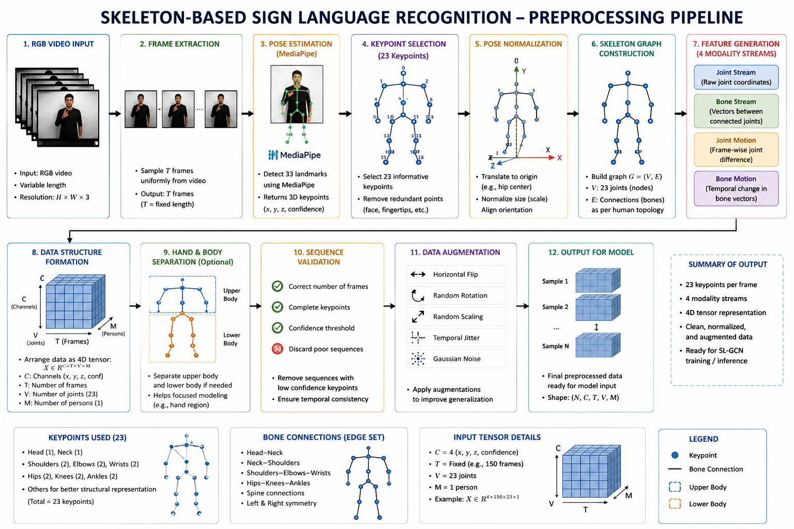
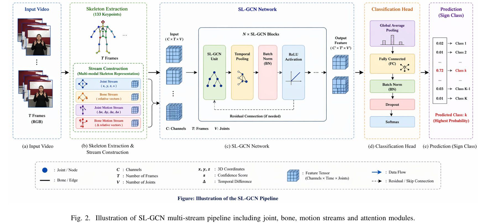
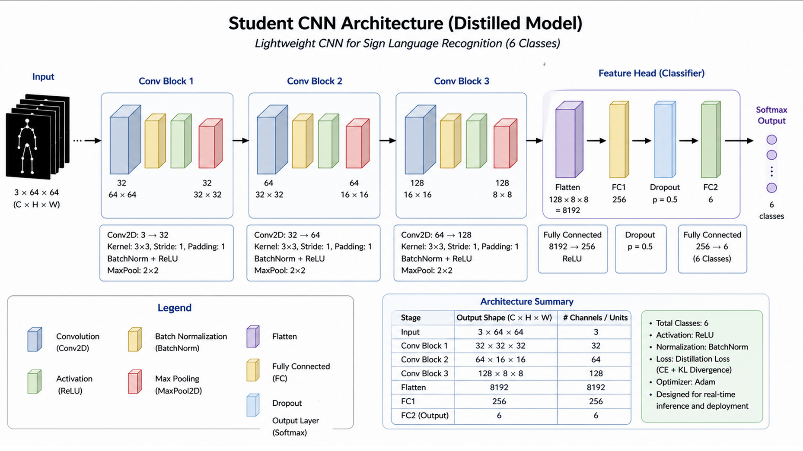
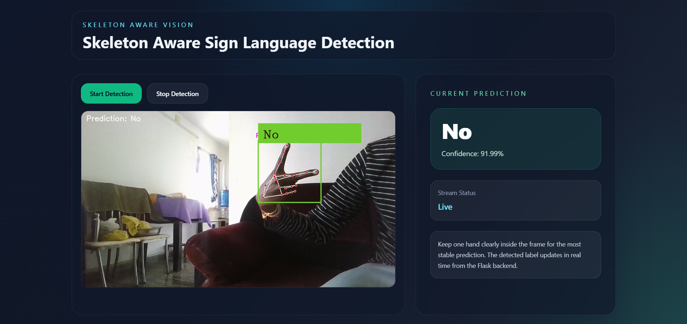
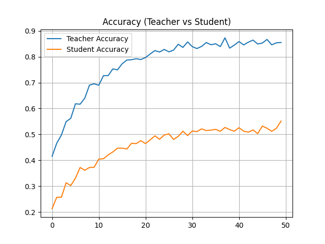
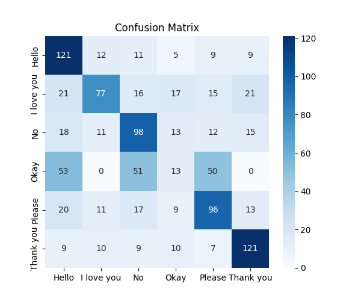
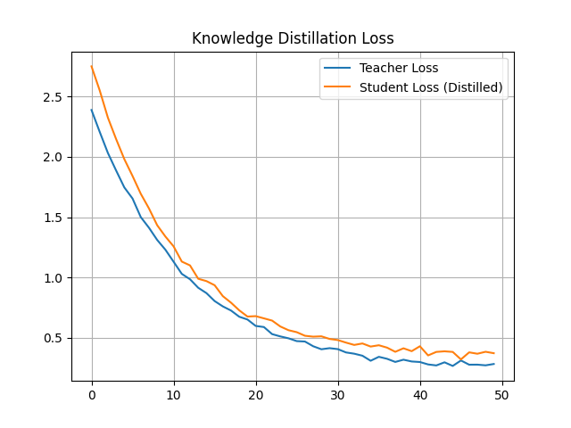
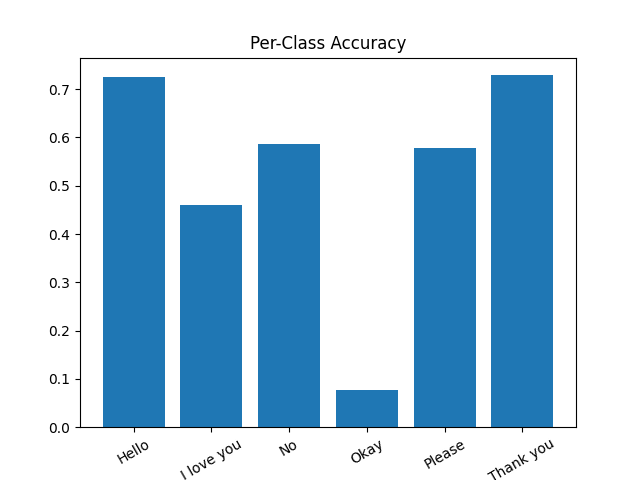

# Skeleton-Aware Sign Language Recognition using SL-GCN and Knowledge Distillation

A lightweight and effective deep learning framework for **real-time sign language recognition**, combining **skeleton-aware graph convolutional networks**, **multimodal learning**, and **knowledge distillation** for efficient deployment and robust gesture recognition.

---

# 🚀 Motivation & Real-World Impact

Communication barriers faced by the deaf and hard-of-hearing community make sign language interpretation extremely important in healthcare, education, workplaces, and public services.

Traditional sign language interpretation requires:
- Human interpreters
- Specialized systems
- High cognitive effort
- Manual communication support

### 🎯 Why Sign Language Recognition?

A real-time sign language recognition system enables:

✅ Faster communication  
✅ Improved accessibility  
✅ Human-computer interaction  
✅ Assistive technology support  
✅ Real-time gesture interpretation  

---

# ❗ Problem with Existing Methods

Traditional and deep learning approaches suffer from:

- ❌ Poor temporal understanding
- ❌ Weak spatial modeling
- ❌ Inconsistent real-time predictions
- ❌ Heavy computational cost
- ❌ Flickering webcam predictions
- ❌ Difficulty capturing motion dynamics

---

# 💡 Our Solution

Our framework introduces:

- **Skeleton-Aware Representation Learning**
- **Spatial-Temporal Graph Convolutional Networks (SL-GCN)**
- **Multi-Stream Feature Learning**
- **Knowledge Distillation for Lightweight Deployment**
- **Prediction Stabilization for Real-Time Inference**

The system combines:
- Joint stream
- Bone stream
- Joint motion stream
- Bone motion stream

for robust multimodal gesture understanding.

---

# 🧠 Architecture Overview

# 📌 Stage 1: Skeleton Extraction Pipeline



*Figure: Real-time skeleton extraction and preprocessing pipeline.*

## Pipeline

```text
Video Input
     ↓
MediaPipe Pose / Hand Extraction
     ↓
Skeleton Keypoint Generation
     ↓
Joint & Bone Feature Construction
     ↓
Motion Feature Extraction
     ↓
Multi-Stream Tensor Generation
```

---

## Features Extracted

The preprocessing stage extracts multiple complementary representations from the skeletal keypoints.

### Extracted Features

| Feature | Description |
|---|---|
| Joint Coordinates | Spatial positions of body/hand joints |
| Bone Vectors | Relative skeletal bone orientations |
| Joint Motion | Temporal movement of joints across frames |
| Bone Motion | Temporal motion of skeletal structure |

These representations allow the model to capture both:
- spatial relationships
- temporal dynamics

for robust sign language understanding.

---

# 📌 Stage 2: SL-GCN Multi-Stream Learning



*Figure: Spatial-Temporal Graph Convolutional Network for multimodal sign language recognition.*

The proposed framework uses **Spatial-Temporal Graph Convolutional Networks (SL-GCN)** to learn spatio-temporal relationships between skeletal joints.

## Architecture Components

- Graph Convolution Layers
- Temporal Convolution Layers
- Spatial Feature Learning
- Temporal Motion Modeling
- Stream-wise Classification Heads

The model processes multiple streams independently before ensemble fusion.

---

## Multi-Stream Representation

| Stream | Purpose |
|---|---|
| Joint Stream | Captures spatial joint positions |
| Bone Stream | Captures skeletal structure |
| Joint Motion Stream | Captures temporal joint movement |
| Bone Motion Stream | Captures structural motion dynamics |

Each stream contributes complementary information for sign recognition.

---

# 📌 Stage 3: Ensemble Fusion

The outputs from all streams are fused using weighted ensemble learning.

## Ensemble Formula

```math
Final = w_1(Joint) + w_2(Bone) + w_3(JointMotion) + w_4(BoneMotion)
```

Where:
- \(w_1, w_2, w_3, w_4\) are stream fusion weights.

---

## Advantages of Ensemble Fusion

✅ Improved robustness  
✅ Better generalization  
✅ Enhanced temporal consistency  
✅ Higher recognition accuracy  

---

# 📌 Stage 4: Knowledge Distillation



*Figure: Teacher-student knowledge distillation framework.*

To enable lightweight deployment, the system employs **knowledge distillation**.

## Teacher Model

- Multi-stream SL-GCN ensemble
- High-capacity architecture
- Strong feature extraction capability

## Student Model

- Lightweight CNN
- Faster inference
- Reduced computational cost

---

## Distillation Objective

The student model learns from:
- hard labels
- soft teacher predictions

using knowledge distillation loss.

```math
L = \alpha L_{CE} + (1-\alpha)L_{KD}
```

Where:
- \(L_{CE}\) = Cross-Entropy Loss
- \(L_{KD}\) = Distillation Loss

---

## Advantages

✅ Faster inference  
✅ Reduced memory usage  
✅ Real-time deployment  
✅ Edge-device compatibility  

---

# 📌 Stage 5: Real-Time Webcam Inference



*Figure: Real-time webcam sign language recognition interface.*

The deployed inference system uses:

- OpenCV
- CvZone
- MediaPipe Hand Tracking
- CNN-based gesture classifier
- Prediction stabilization

---

## Real-Time Inference Pipeline

```text
Webcam Input
      ↓
Hand Detection
      ↓
Bounding Box Extraction
      ↓
Image Preprocessing
      ↓
CNN Classification
      ↓
Prediction Stabilization
      ↓
Live Prediction Display
```

---

## Prediction Stabilization

To reduce unstable predictions and flickering outputs, the system uses:

- Sliding window smoothing
- Confidence thresholding
- Majority voting

This improves:
- temporal stability
- prediction consistency
- real-time usability

---

# 📊 Experimental Results

## Top-1 vs Top-5 Accuracy

| Metric | Accuracy |
|---|---|
| Top-1 Accuracy | 52% |
| Top-5 Accuracy | 86% |

---

## Stream-wise Performance

| Stream | Top-1 Accuracy | Top-5 Accuracy |
|---|---|---|
| Joint Stream | 42% | 74% |
| Bone Stream | 27% | 55% |
| Joint Motion Stream | 18% | 38% |
| Bone Motion Stream | 19% | 40% |
| Ensemble Model | 52% | 86% |

The ensemble model achieves the best overall recognition performance by combining complementary stream representations.

---

# 📈 Training & Evaluation Visualizations

## Accuracy Curve



The teacher model converges faster and achieves higher accuracy compared to the distilled student model.

---

## Confusion Matrix



The confusion matrix demonstrates class-wise prediction performance and highlights commonly confused gestures.

---

## Knowledge Distillation Loss



The student model effectively learns soft representations from the teacher network through distillation.

---

## Per-Class Accuracy



Per-class accuracy analysis shows the recognition capability of the model across different sign categories.

---

# 📁 Project Structure

```text
Sign-Language-Recognition/
│
├── assets/
│   ├── preprocessing_pipeline.png
│   ├── overall_pipeline.png
│   ├── slgcn_multimodal_streams_architecture.png
│   ├── student_cnn_architecture.png
│   ├── demo_interface.png
│
├── configs/
│   ├── train_joint.yaml
│   ├── train_bone.yaml
│   ├── train_joint_motion.yaml
│   ├── train_bone_motion.yaml
│   ├── test_joint.yaml
│   ├── test_bone.yaml
│   ├── test_joint_motion.yaml
│   └── test_bone_motion.yaml
│
├── models/
│   ├── sl_gcn.py
│   ├── st_gcn.py
│   ├── student_cnn.py
│   ├── ensemble_model.py
│   └── distillation.py
│
├── demo/
│   ├── webcam_demo.py
│   ├── realtime_predict.py
│   ├── app.py
│   ├── prediction_stabilizer.py
│   └── templates/
│
├── demo results/
│   ├── accuracy.png
│   ├── confusion.png
│   ├── loss.png
│   └── per_class.png
│
├── requirements.txt
├── README.md
└── LICENSE
```

---

# 📥 Dataset

We use the:

## WLASL Dataset

Dataset Link:

https://huggingface.co/datasets/Voxel51/WLASL

---

## Dataset Setup

1. Download dataset
2. Extract into:

```text
data/sign/
```

---

# ⚙️ Installation

## Clone Repository

```bash
git clone https://github.com/your-username/Skeleton-Aware-Sign-Language-Recognition.git

cd Skeleton-Aware-Sign-Language-Recognition
```

---

## Create Virtual Environment

```bash
python -m venv venv
```

---

## Activate Environment

### Windows

```bash
venv\Scripts\activate
```

### Linux / Mac

```bash
source venv/bin/activate
```

---

## Install Dependencies

```bash
pip install -r requirements.txt
```

---

# 🏋️ Training

## Generate Skeleton Data

```bash
python tools/sign_gendata.py
```

---

## Generate Motion Streams

```bash
python tools/gen_motion_data.py
```

---

## Train Joint Stream

```bash
python main.py --config configs/train_joint.yaml
```

---

## Train Bone Stream

```bash
python main.py --config configs/train_bone.yaml
```

---

## Train Joint Motion Stream

```bash
python main.py --config configs/train_joint_motion.yaml
```

---

## Train Bone Motion Stream

```bash
python main.py --config configs/train_bone_motion.yaml
```

---

# 🔍 Inference

## Real-Time Webcam Demo

```bash
python demo/webcam_demo.py
```

---

## Flask Web Deployment

```bash
python demo/app.py
```

Open:

```text
http://127.0.0.1:5000
```

---

# 📈 Evaluation

Generate evaluation metrics and plots:

```bash
python results/generate_results.py
```

Metrics include:
- Accuracy
- Top-1 / Top-5
- Confusion Matrix
- Per-Class Accuracy
- Distillation Loss

---

# 🧠 Key Idea

> Instead of relying only on image classification, we first learn robust skeleton-aware spatial-temporal representations using multi-stream graph convolutional networks, then optimize deployment using knowledge distillation and prediction stabilization.

---

# 🔮 Future Work

- Sentence-level sign language recognition
- Transformer-based gesture modeling
- Mobile deployment
- TensorRT optimization
- Multi-person recognition
- Attention-based temporal transformers

---

# 👨‍⚕️ Real-World Impact

This system helps by:

- Improving accessibility
- Assisting communication
- Enabling real-time interaction
- Supporting educational tools
- Assisting healthcare communication

---

# 🌟 Novelty

A lightweight multimodal framework combining:

- Skeleton-aware graph learning
- Multi-stream temporal modeling
- Ensemble learning
- Knowledge distillation
- Real-time stabilized inference

for efficient and robust sign language recognition.

---

# 📚 References

1. SAM-SLR-v2  
   https://github.com/jackyjsy/SAM-SLR-v2

2. WLASL Dataset  
   https://huggingface.co/datasets/Voxel51/WLASL

3. MediaPipe  
   https://developers.google.com/mediapipe

4. CvZone  
   https://github.com/cvzone/cvzone

5. OpenCV  
   https://opencv.org/

---

# ⚠️ Academic Disclaimer

This repository is a research replication and educational implementation inspired by the SAM-SLR-v2 framework.

Original contributions and baseline architectures belong to the respective authors.

---

# 📄 License

This project is intended for academic, educational, and research purposes only.
